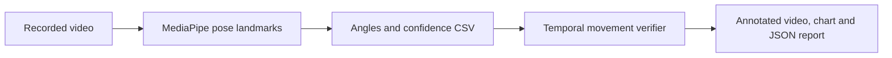
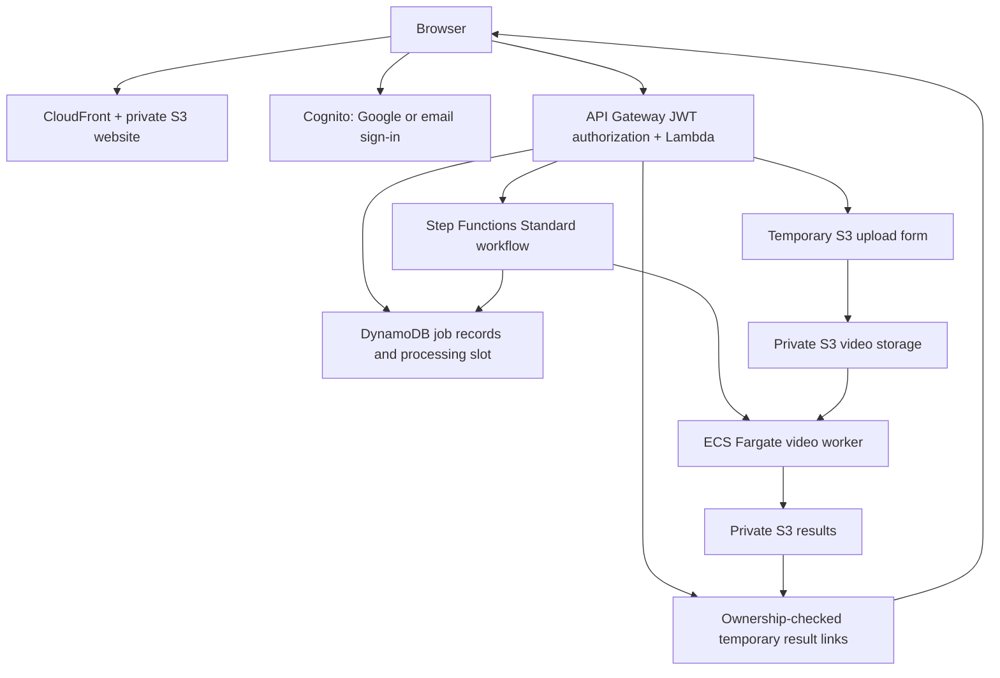

# Pushup Verifier

**Upload a pushup video. See the movement, inspect the evidence, and understand the result.**

Pushup Verifier combines computer vision, a reproducible decision engine, and an AWS application that runs video analysis on demand. It estimates body landmarks with MediaPipe, measures elbow and body angles, and follows a top → bottom → top movement sequence to report accepted, rejected, or unassessable attempts.

**[Try the live application](https://dg05a9no1enlg.cloudfront.net/)** · **[Watch the validation video](docs/media/validation-demo.mp4)** · **[Read the research findings](docs/research-overview.md)**

The public sample needs no account. Sign in with Google or email/password to upload your own video; no individual approval is required.

## Animated demo


The mixed validation recording contains **full → shallow → full → shallow → full** attempts. With settings fixed before evaluation, the verifier reported **5 completed movements: 3 accepted and 2 rejected for depth**, with no unassessable decisions or partial starts. See the [saved validation report](docs/pilot3B-validation.md).

This is agreement on one new recording from the same participant, not a general accuracy estimate. The animated demo illustrates the pipeline; newly generated cloud videos use the updated counter spacing.

## What the application delivers

- **Annotated replay:** body landmarks, measured angles, confidence, and separate completed/accepted/rejected counters.
- **Angle chart:** raw elbow measurements and the top/depth thresholds used for assessment.
- **JSON report:** timestamped decisions, uncertainty intervals, partial starts, configuration, model hash, dependency versions, and processing time.
- **An authenticated upload flow:** temporary upload forms, private storage, and ownership checks on job and result requests.
- **On-demand processing:** one Fargate job at a time, a processing spinner, status polling, and reconnection after refreshing the same browser tab.
- **Automatic file retention:** uploads and processing copies expire after 1 day; results expire after 7 days. S3 deletion is asynchronous. Result links last 10 minutes and can be renewed by refreshing while files remain available.

Supported uploads are **MP4, MOV, or WebM**, up to **200 MiB and 120 seconds**, with a maximum input pixel area of 4096 × 2160. Select the anatomical side facing the camera. Processing normalizes orientation and dimensions, converts footage to 30 fps, and strips audio.

## How it works



Extraction and decision replay are separate: saved observations can be replayed with different policies without rerunning pose estimation. The deployed worker uses the frozen **140° top / 90° depth** configuration, temporal smoothing, separate movement/alignment confidence gates, and explicit partial-start reporting.

MediaPipe supplies pretrained perception. The project work is the geometry, sequence logic, handling of uncertainty, evaluation, and application engineering—not training a pose model.

## Cloud architecture



The workflow checks ownership and job readiness, claims a single processing slot, copies the verified input using its recorded ETag, and starts the container. It checks the worker exit code, records success or failure, and releases the slot. The worker state has a **15-minute timeout**; the workflow has a **20-minute limit**. Interrupted executions or failed cleanup can leave the slot locked for operator review.

The AWS deployment is live in **us-east-2 (Ohio)**. The browser-to-results flow has been exercised with both Google and email accounts. Separate checks confirmed that unsigned requests receive 401, and a second account cannot retrieve another account's job. See [deployment and operations](docs/aws-deployment.md).

## Run locally

The decision engine uses only the Python standard library. From the repository root:

```bash
python -m unittest discover -s tests -v
python -m pushup.replay examples/one_rep.csv --mode immediate
```

The example CSV is synthetic; it tests behavior rather than model accuracy.

For the complete video processor, use the tested Linux/WSL Python 3.12 environment:

```bash
python -m pip install -r requirements/app.lock.txt

python -m pushup.process data/raw/your_video.MOV \
  --side right \
  --model models/pose_landmarker_full.task \
  --output results/new-job
```

Download the **Full Pose Landmarker** model from the [MediaPipe model documentation](https://developers.google.com/edge/mediapipe/solutions/vision/pose_landmarker#models) and place it at `models/pose_landmarker_full.task`. Use a fresh output directory. Private recordings, processing outputs, and model weights are excluded from Git.

To run the local upload interface:

```bash
python -m uvicorn pushup.web:app --host 127.0.0.1 --port 8000 --workers 1
```

Or use Docker:

```bash
docker compose -f docker/compose.yaml up --build
```

Open `http://127.0.0.1:8000`. This local interface has different access controls and retention from the cloud app; keep it bound to loopback. See [local setup](docs/local-app.md) and [Docker build commands](docker/README.md).

## Build the website

The hosted frontend is plain HTML/CSS and bundled JavaScript, with `oidc-client-ts` handling the authorization-code/PKCE sign-in flow.

```bash
npm ci
npm run build:auth
```

Edit `site-src/auth.js`; the build writes `site/static/auth.js`. The deployable website is in `site/`. Deployment commands and retention configuration are documented in [AWS operations](docs/aws-deployment.md).

## Research and limitations

**Completed movement does not mean accepted form.** Missing alignment evidence, tracking gaps, and partial starts are reported explicitly. Camera perspective and incorrect landmarks can affect measured angles even when confidence scores look strong. Projected elbow angles are an operational proxy for depth, not proof that the upper arm is parallel to the floor.

Development recordings exposed missed peaks, occlusion, framing problems, and unreliable ankle evidence. The project preserves those failures alongside the successful mixed validation clip. Broader testing across participants and camera setups, plus independent timestamped labels, is still needed. This is an experimental assessment, not an official fitness score or military test scorer.

Explore the [research overview](docs/research-overview.md), [rubric](docs/rubric.md), [evaluation plan](docs/evaluation.md), and [pose walkthrough notebook](notebooks/01_pose_overlay_walkthrough.ipynb).

## Repository guide

| Directory | Purpose |
|---|---|
| `pushup/` | Pose extraction, geometry, decision engine, rendering, and local/cloud workers |
| `cloud/` | Lambda API, Step Functions workflow, and S3 retention configuration |
| `site/` | Deployable website and published sample assets |
| `site-src/` | Authentication, upload, polling, and result-display JavaScript source |
| `docker/` | Local and worker Dockerfiles, Compose configurations, and build guide |
| `requirements/` | Python dependency lists and tested Linux/Python 3.12 snapshot |
| `config/` | Baseline and frozen experimental configurations |
| `tests/`, `app_tests/` | Decision-engine and local application checks |
| `examples/` | Animated demo, synthetic inputs, and diagnostic/learning scripts |
| `docs/` | Research evidence, validation reports, setup, and operations |
| `notebooks/` | Incremental computer vision walkthrough |

## Next steps

- Expire DynamoDB job records while preserving the processing-slot record.
- Add explicit deletion and improve recovery for interrupted processing.
- Add per-user usage limits and more automated cloud integration checks.
- Expand validation with independent timing labels and a wider set of participants and recording conditions.

The deferred hand-release experiment (`hrp.py` / `hrp_replay.py`) is separate from the conventional-pushup pipeline and is not a completed video detector.
