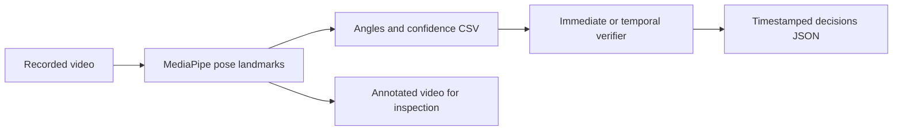

# Pushup Verifier

**Computer vision research in progress: measuring pushup motion and evaluating when a rule-based verifier can make a reliable decision.**

Pushup Verifier processes a recorded video, estimates body landmarks with MediaPipe, measures elbow and body angles, and checks a conventional top → bottom → top pushup sequence. Its purpose is to explore the engineering behind video-based procedure verification: translating observable rules into code, handling uncertain observations, and evaluating decisions against human review.

The current prototype runs locally with Python, MediaPipe, OpenCV, and NumPy. It uses a pretrained pose model; model training is not part of the current work.

## What is implemented

- Video-to-measurement extraction with an explicit anatomical side selection.
- Elbow-angle and shoulder–hip–ankle calculations in pixel coordinates.
- Annotated video showing landmarks, angles, confidence, and source timestamps.
- Immediate and temporal decision methods operating on identical saved observations.
- Timestamped accepted, rejected, and unassessable attempts, plus evidence-gap intervals.
- A learning notebook that builds the landmark and geometry workflow incrementally.
- 30 unit tests covering geometry, sequence logic, threshold boundaries, and uncertainty, including a deferred hand-release experiment.

**Status:** three development videos have been processed. Independent test-set evaluation, detailed per-repetition labels, and robust handling of missed top positions are still in progress. This is not a validated fitness assessment or an official military test scorer.

## Pipeline



The separation between extraction and replay makes experiments reproducible: thresholds and temporal processing can be compared without rerunning pose estimation.

## Research question

**Does smoothing and persistent threshold evidence reduce false decisions without suppressing real movement transitions?**

Immediate mode uses raw measurements. Temporal mode applies an elapsed-time exponential moving average and requires threshold conditions to persist for 0.1 seconds. Both use the same confidence checks and movement sequence.

## Initial pilot findings

| Development clip | Manual observation | Immediate mode | Temporal mode |
|---|---|---|---|
| Full repetitions | 5 completed repetitions | 5 accepted | 2 accepted; 1 unfinished tracked attempt |
| Shallow repetitions | 3 attempts, all insufficient depth | 3 rejected for depth | 1 rejected for depth; 1 unfinished tracked attempt |
| Visibility challenge | 4 valid attempts reported by the recorder; attempts 2 and 4 obscured | 2 interrupted tracked attempts; none accepted/rejected | No attempts established; evidence gaps recorded |

**These are exploratory development results, not accuracy claims.** The top threshold was tuned using the full-repetition clip. Manual labels are currently clip-level observations; independent, timestamped adjudication is pending. An unfinished or interrupted tracked attempt can span or omit multiple actual movements.

The immediate method agrees with the manual counts on the first two clips. The temporal method suppresses later peaks near the top threshold and can merge several movements into one unfinished attempt. On the visibility clip, neither method produced an assessable decision for the clear attempts. A single low-confidence frame currently interrupts an active attempt.

These failures are part of the research: they expose tradeoffs between noise suppression, decision coverage, and faithful segmentation. See [pilot findings and limitations](docs/pilot-results.md) and the [evaluation plan](docs/evaluation.md).

## Observable rules

| Parameter | Current pilot setting |
|---|---:|
| Top elbow angle | ≥145° |
| Departure from top | ≤130° |
| Bottom elbow angle | ≤90° |
| Body alignment angle | ≥160° |
| Minimum landmark confidence | 0.6 |
| Maximum observation gap | 0.25 seconds |
| Temporal persistence | 0.10 seconds |
| Smoothing time constant | 0.08 seconds |

The 145° top setting is a relaxed development criterion for the existing recordings, not proof of full elbow extension. A projected 90° elbow angle is also not geometrically equivalent to the upper arm being parallel to the floor. Camera perspective, landmark placement, and occlusion affect these measurements.

Confidence is the minimum visibility/presence score across the selected shoulder, elbow, wrist, hip, and ankle. It is not a calibrated probability that an angle or decision is correct. See the complete [rubric](docs/rubric.md).

## Quick start: no video required

Python 3.10+ runs the decision engine and tests with only the standard library. From the repository root:

```bash
python -m unittest discover -s tests -v
python -m pushup.replay examples/one_rep.csv --mode immediate
python -m pushup.replay examples/one_rep.csv --mode temporal --output results/synthetic_demo.json
```

The example CSV is synthetic. It verifies software behavior and is not experimental evidence.

## Run on your own video

The video workflow was exercised with Python 3.12 in a Conda environment on Linux/WSL. Use one environment for the whole project:

```bash
conda create -n pushup-verifier python=3.12 pip
conda activate pushup-verifier
python -m pip install -r requirements-video.txt
```

On Ubuntu/WSL, if MediaPipe reports a missing `libGLESv2.so.2`:

```bash
sudo apt update
sudo apt install libgles2
```

Download the **Full Pose Landmarker** `.task` bundle from the [official MediaPipe model page](https://developers.google.com/edge/mediapipe/solutions/vision/pose_landmarker#models), and place it at `models/pose_landmarker_full.task`. Place your own video in `data/raw/`. Videos and model weights are excluded from the repository.

```bash
python -m pushup.extract \
  data/raw/your_video.MOV \
  --model models/pose_landmarker_full.task \
  --side right \
  --output data/observations/your_video.csv \
  --annotated-video results/your_video_overlay.mp4 \
  --review-frame results/your_video_max_angle.png

python -m pushup.replay \
  data/observations/your_video.csv \
  --mode immediate \
  --output results/your_video_immediate.json

python -m pushup.replay \
  data/observations/your_video.csv \
  --mode temporal \
  --output results/your_video_temporal.json
```

Select the anatomical side facing the camera. Extraction requires new output filenames and will not intentionally overwrite existing files. Replay applies the settings in `config/default.json` and records them in each report. Existing overlays retain the thresholds shown when they were generated.

The annotated preview uses nominal FPS without audio; its displayed timestamps come from the source video. The review PNG selects the greatest reliable raw elbow angle, not a guaranteed fully extended pose. `.MOV` decoding depends on the installed codecs, and the extractor requires increasing source timestamps.

## Explore the notebook

[Pose overlay walkthrough](notebooks/01_pose_overlay_walkthrough.ipynb) records the hands-on learning process. Use the project environment as its kernel. Notebook development is ongoing; the command-line modules are the complete extraction and replay implementation. Notebook outputs are omitted from the published version to avoid embedding private video frames or environment paths.

For notebook work, install `jupyterlab`, `ipykernel`, and `matplotlib` in the same environment if needed. The exploratory notebook may use arm-only confidence, whereas the command-line pipeline checks five landmarks.

## Repository guide

| Location | Purpose |
|---|---|
| `pushup/extract.py` | Video decoding, pose estimation, and CSV export |
| `pushup/geometry.py` | Joint-angle calculation |
| `pushup/overlay.py` | Diagnostic video annotation |
| `pushup/engine.py` | Conventional-pushup state machine |
| `pushup/replay.py` | Reproducible decision replay |
| `config/default.json` | Current pilot thresholds |
| `tests/` | Synthetic behavior and boundary tests |
| `docs/` | Rubric, collection guide, pilot findings, and evaluation plan |
| `examples/` | Small synthetic observation fixtures |
| `notebooks/` | Incremental learning walkthrough |

`hrp.py`, `hrp_replay.py`, and their tests are a deferred hand-release sequence experiment. They do not run in the conventional-pushup pipeline and are not a completed video-based HRP detector.

## Next research steps

- Annotate attempt boundaries and obscuration intervals independently of predictions.
- Overlay verifier state and raw/smoothed measurements for failure analysis.
- Evaluate smoothing and persistence separately.
- Investigate brief-dropout recovery without inventing motion during missing evidence.
- Freeze settings, then evaluate new recording sessions and additional participants.

MediaPipe performs the pretrained perception step. The project work focuses on geometry, stateful procedure verification, diagnostics, and transparent evaluation. See [MediaPipe documentation](https://developers.google.com/edge/mediapipe/solutions/vision/pose_landmarker) for model details.
